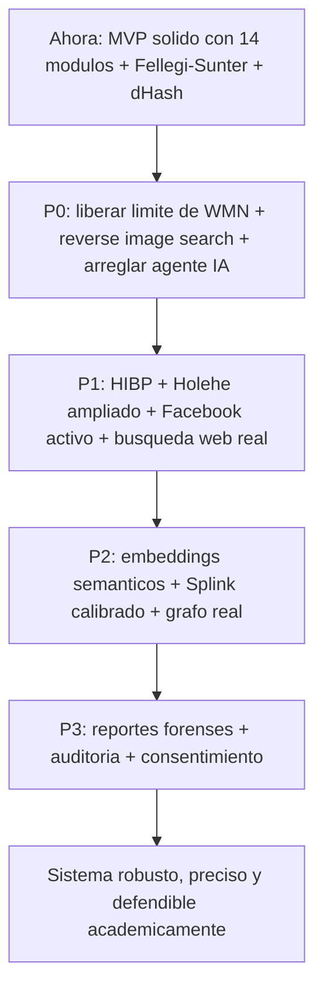

# Análisis Comparativo: `person-map` vs. el Estado del Arte Mundial en OSINT de Personas

**Fecha del análisis:** 2026-09-03
**Alcance:** Código fuente de `backend/app/tools`, `backend/app/engine`, `backend/app/identity`, `backend/app/agent`, comparado contra las herramientas OSINT open-source y comerciales más relevantes del mundo (Sherlock, Maigret, WhatsMyName, Holehe, GHunt, PhoneInfoga, Ignorant, theHarvester, Amass, Splink, Spiderfoot, OpenOSINT, VENOM, clawithme, Wiwok, entre otras).

---

## 0. Respuesta directa a la pregunta central

> **¿Ya tienes "lo mejor de lo mejor" en OSINT implementado?**

**No todavía — pero tienes algo más valioso que una simple colección de herramientas: ya tienes una arquitectura de correlación bien pensada, que es precisamente la pieza que la mayoría de proyectos "todo-en-uno" (incluyendo varios que se mencionan abajo) NO tienen.**

Desglosado con honestidad:

| Dimensión | Nivel actual | Comentario |
|---|---|---|
| **Cobertura de fuentes/herramientas** | 🟡 Medio (6/10) | 14 módulos bien construidos, pero cubren solo una fracción de las categorías que un sistema "world-class" necesita (falta imagen/rostro, Google OSINT, breach real, teléfono real, dominios/WHOIS, redes regionales como Facebook/VK). |
| **Calidad de ingeniería de cada módulo** | 🟢 Alto (8/10) | Código limpio, async, con manejo de errores, inspirado correctamente en técnicas reales de Spiderfoot/Holehe/WhatsMyName (triple validación, `m_string`/`e_string`, etc.). |
| **Motor de correlación de identidad** | 🟢 Alto-diferencial (8/10) | Aquí es donde de verdad se destaca: Fellegi-Sunter con log-likelihood ratios + perceptual hashing de avatares (dHash) es un enfoque más riguroso que el 90% de las herramientas OSINT open-source que existen (la mayoría no correlaciona nada, o usa un simple `fuzzy_ratio > 0.8`). |
| **Orquestador heurístico (`rule_engine`)** | 🟢 Alto (8/10) | El pivoteo automático multi-ronda con deduplicación es sólido y comparable a lo que hace la "Smart OSINT Mode" de Wiwok o el motor recursivo de Maigret. |
| **Orquestador con IA (`autonomous_agent`)** | 🟡 Medio (6/10) | Buena base (function calling agnóstico vía LiteLLM), pero tiene una inconsistencia grave: **solo expone 7 de las 14 herramientas al LLM**, por lo que el modo "agentic" es en realidad *menos* capaz que el modo heurístico puro. Esto hay que arreglarlo. |
| **Robustez ante bloqueos/anti-bot** | 🔴 Bajo (3/10) | Un solo User-Agent hardcodeado, sin rotación de proxies, sin Tor, sin backoff/retry, sin control de tasa. En producción esto se degradará rápido. |
| **Cobertura de "señales fuertes" de identidad** | 🔴 Bajo (3/10) | Falta la señal más potente en OSINT de personas: **reconocimiento/búsqueda inversa de rostro e imagen** (no solo comparar avatares ya descubiertos, sino buscar la foto en la web abierta). También falta OSINT de cuentas Google (estilo GHunt), que es la segunda señal más rica. |
| **Ética/legalidad/auditoría** | 🟡 Medio (5/10) | Hay verificación manual de entidades y buen enfoque pedagógico, pero falta consentimiento explícito, logging de auditoría, rate-limiting por usuario y política de retención de datos — todo lo cual se describe en `analisis.md` (sección 15) pero aún no está implementado. |

**Veredicto:** Base de **nivel "avanzado universitario / MVP profesional serio"**, con un motor de correlación que ya es más sofisticado que la mayoría de proyectos OSINT open-source (incluido el propio candidato de referencia mencionado, OpenOSINT). Faltan piezas concretas y bien identificadas —no una reconstrucción— para llegar a "world-class". Abajo el detalle con evidencia y referencias.

---

## 1. Inventario de lo que ya existe (mapeado a su equivalente mundial)

| Módulo | Técnica que usa | Equivalente / inspiración en el mundo real | Evaluación |
|---|---|---|---|
| `username_finder.py` | Dataset WhatsMyName (WMN) + triple validación (`e_code`, `e_string`, `m_string` + heurística "musthavename" de Spiderfoot) | [WhatsMyName](https://github.com/WebBreacher/WhatsMyName), [Sherlock](https://github.com/sherlock-project/sherlock), [Blackbird](https://github.com/p1ngul1n0/blackbird) | 🟢 Técnica correcta, pero **limitada artificialmente**: el `wmn-data.json` bundleado ya trae ~700 sitios, pero `MAX_SITES = 160` los recorta a menos de 1/4. Esta es la mejora más barata y de mayor impacto disponible hoy mismo. |
| `email_enumerator.py` | Chequeo silencioso de registro (Spotify, Discord, GitHub, Steam, etc.) sin enviar verificación | [Holehe](https://github.com/megadose/holehe) (120+ plataformas) | 🟡 Buena técnica, pero cubre ~20 de las 120+ que soporta Holehe. |
| `gravatar_deep.py` | Extracción de perfil completo desde hash MD5 de Gravatar | Spiderfoot `sfp_gravatar` | 🟢 Módulo de alto valor y poco replicado — bien hecho. |
| `keybase_resolver.py` | Resolución de identidad criptográficamente probada | Spiderfoot `sfp_keybase` | 🟢 Señal de altísima confianza (proof cryptográfico), correctamente ponderada en `scorer.py` (`m=0.999`). Excelente elección. |
| `github_deep_scanner.py` | Extracción de emails de autoría en commits + inferencia de huso horario por patrón de actividad | Técnica clásica de OSINT de desarrolladores (usada por GHunt-style tools y recon-ng) | 🟢 Una de las piezas más originales y valiosas — pocas herramientas infieren timezone por patrón de commits. |
| `social_verifier.py` | Scraping de OpenGraph + fuzzy matching (`thefuzz`) contra nombre/universidad/email | Técnica estándar de verificación de perfil | 🟢 Correcto, aunque el fuzzy matching léxico tiene el límite típico: no capta similitud semántica (ver sección 4). |
| `search_dorker.py` | Dorks vía scraping HTML de DuckDuckGo | Google/Bing dorking manual, `generate_dorks` de OpenOSINT | 🔴 El eslabón más frágil: scraping HTML sin API es fácilmente bloqueado/rate-limited, y solo 4 queries × 5 resultados = cobertura muy pobre. |
| `academic_finder.py` (OpenAlex) | Búsqueda de autores/papers académicos | Nadie más lo hace tan bien — ni Sherlock, ni Maigret, ni Holehe cubren huella académica | 🟢 **Diferenciador real.** Rarísimo en el ecosistema OSINT, y perfecto para el público objetivo (estudiantes universitarios). |
| `dni_lookup.py` (Perú) | Consulta pública RENIEC/SUNAT | Nicho geográfico — no hay equivalente global | 🟢 Buena localización, aunque depende de una API de terceros no oficial (fragilidad). |
| `phone_lookup.py` | `phonenumbers` (libphonenumber) — metadata estática | [PhoneInfoga](https://github.com/sundowndev/phoneinfoga), [Ignorant](https://github.com/megadose/ignorant) | 🟡 Solo da metadata de formato/operador. No hace OSINT activo (no verifica si el número tiene WhatsApp/Telegram/Instagram real como sí hace Ignorant). |
| `breach_checker.py` (XposedOrNot) | Chequeo de brechas gratuito | [HaveIBeenPwned](https://haveibeenpwned.com/API/v3), [DeHashed](https://dehashed.com), [LeakCheck](https://leakcheck.io), [IntelligenceX](https://intelx.io) | 🟡 XposedOrNot es una fuente válida y gratuita, pero mucho más limitada que HIBP (curada, ampliamente reconocida) y no cubre "stealer logs" (la fuente moderna más rica en credential-stuffing). |
| `wikipedia_edits.py` | Historial de contribuciones vía MediaWiki API | Spiderfoot `sfp_wikipediaedits` | 🟢 Nicho pero correcto. |
| `social_url_extractor.py` | Regex de alta precisión sobre URLs candidatas | Spiderfoot `sfp_social` | 🟢 Buena capa de "cero red" para pivoteo. |
| **`identity/scorer.py`** | **Fellegi-Sunter probabilístico con log-likelihood ratios (m/u fijos por campo)** | [Splink](https://github.com/moj-analytical-services/splink) (MoJ UK), literatura clásica de "record linkage" | 🟢🟢 **La joya del sistema.** Pocos proyectos OSINT open-source implementan Fellegi-Sunter real (la mayoría hace `if fuzz.ratio > 80: match`). Ver sección 4 para matices y mejoras. |
| **`identity/avatar_hasher.py`** | Perceptual hashing (dHash) + distancia de Hamming entre avatares ya descubiertos | Técnica usada por [clawithme](https://github.com/yes999zc/clawithme) (avatar pHash como señal de clustering) | 🟢 Correcto y poco común, pero limitado: solo compara avatares **entre entidades que ya se encontraron**, no busca la imagen en la web abierta (ver gap crítico #1). |
| **`engine/rule_engine.py`** | Orquestador determinista multi-ronda con pivoteo heurístico automático | Similar en espíritu al modo "Smart OSINT" de [Wiwok](https://github.com/Kirozaku/Wiwok) o al motor recursivo de Maigret | 🟢 Buen diseño: gratuito, determinista, sin dependencia de LLM, con deduplicación por clave compuesta. |
| **`agent/autonomous_agent.py`** | Agente LLM con function calling vía LiteLLM (agnóstico de proveedor) | [OpenOSINT](https://github.com/OpenOSINT/OpenOSINT), función "AI tool chaining" | 🟡 Buena arquitectura base, pero con un bug de diseño importante (ver sección 5). |

---

## 2. Comparativa frente a las herramientas OSINT "de referencia mundial" (2025-2026)

| Categoría | Líder(es) mundiales | Cobertura en `person-map` | Brecha |
|---|---|---|---|
| **Username enumeration** | Maigret (3,100+ sitios, con parsing recursivo de perfiles), WhatsMyName (700+), Sherlock (400+), Blackbird | WMN dataset bundleado (700+) pero **limitado a 160** por `MAX_SITES` | 🔴 Fácil de arreglar: solo aumentar el límite y añadir concurrencia/backoff. |
| **Email enumeration** | Holehe (120+ servicios) | 20 servicios | 🟡 Ampliable módulo por módulo. |
| **Breach / credential exposure** | HaveIBeenPwned (curada, gratis en modo consulta simple), DeHashed, LeakCheck, Intelligence X (paste sites + dark web), Hudson Rock (infostealer logs) | XposedOrNot únicamente | 🔴 Falta la fuente más citada del mundo (HIBP) y las de "stealer logs" (hoy la fuente #1 en calidad de OSINT de brechas). |
| **Phone OSINT** | PhoneInfoga (footprinting activo + dorks), Ignorant (WhatsApp/Instagram/Snapchat/Amazon silent check) | Solo metadata de `phonenumbers` | 🔴 No se verifica si el número existe realmente en redes sociales (posible con técnicas silenciosas como Ignorant). |
| **Google Account OSINT** | [GHunt](https://github.com/mxrch/GHunt) — pivotea de un email a Gaia ID → Maps reviews (geolocalización) → Calendar público → YouTube → Play Games | **No existe** | 🔴 **Gap crítico.** Para un Gmail (extremadamente común entre estudiantes), GHunt es la fuente más rica de correlación geográfica y de servicios que existe, y es gratuita. |
| **Reverse image / face search** | PimEyes, FaceCheck.ID, Yandex Images, `unavatar` (para pivotear URLs de avatar) | **No existe** — `avatar_hasher.py` solo compara avatares entre sí, no busca en la web | 🔴 **Gap crítico #1.** Es la señal de correlación más fuerte que existe para "personas" y ni siquiera los frameworks más completos (OpenOSINT, VENOM) la implementan bien; ganar esta capacidad implicaría una ventaja competitiva real. |
| **Búsqueda web / dorking** | theHarvester (multi-motor: Baidu, Brave API, crt.sh, etc.), Bright Data SERP API (usada por OpenOSINT `search_dorks_live`) | Scraping HTML de DuckDuckGo (frágil, 4 queries) | 🟡 Migrar a una API real (Brave Search API tiene tier gratuito, o SearXNG auto-hospedado) eliminaría el punto más frágil del pipeline. |
| **Redes regionales (Facebook, VK, WeChat, etc.)** | Maigret/WMN cubren Facebook, VK, Weibo, OK.ru nativamente | Solo detección pasiva vía dork/regex, sin verificación activa | 🟡 Facebook es probablemente la red *más* relevante para el público objetivo (estudiantes LatAm) y hoy está subrepresentada. |
| **Dominio / infraestructura personal** | theHarvester, Amass, `crt.sh` (certificate transparency), WHOIS | **No existe** | 🟡 Útil si el objetivo tiene blog/portfolio personal (`juan.dev`), común en estudiantes de ingeniería/CS. |
| **Motor de correlación / entity resolution** | [Splink](https://github.com/moj-analytical-services/splink) (Fellegi-Sunter con EM algorithm no supervisado, term-frequency adjustment), Union-Find de clawithme | Fellegi-Sunter con pesos m/u **fijados manualmente** (no aprendidos) | 🟡 Enfoque correcto en forma pero no calibrado con datos reales — ver sección 4. |
| **Orquestador IA** | OpenOSINT (MCP nativo, "hard-stop tool calls" anti-alucinación, 20 tools), clawithme (LLM solo para *verificar* confianza, no para decidir qué ejecutar), VENOM v7 (agente que cruza scraping en vivo con datos de brechas) | LiteLLM function calling con 7/14 tools mapeadas | 🟡 Ver sección 5 — arreglo concreto y de bajo esfuerzo. |
| **Reporting / exportación** | clawithme (HTML/PDF/JSON/MD con PII-redaction), Wiwok (JSON+TXT+HTML), Maigret (HTML/PDF/XMind) | Botón "Imprimir / Guardar como PDF" del navegador | 🟡 Funcional pero no es un informe "forense" generado server-side con metadatos de cadena de custodia. |
| **Anti-bloqueo / resiliencia de red** | Sherlock/Maigret con soporte Tor y proxy; VENOM con `curl_cffi`/fingerprinting; clawithme con SearXNG fallback | Un solo User-Agent hardcodeado por módulo, sin rotación, sin backoff, sin Tor | 🔴 Riesgo real de baneo de IP en producción al lanzar 160+ requests concurrentes por username. |

---

## 3. Herramientas de clase mundial que conviene conocer (respuesta directa a "cuáles son las mejores OSINT que existen para personas")

### Username / identidad multiplataforma
- **[Maigret](https://github.com/soxoj/maigret)** — 3,100+ sitios, parsing recursivo de perfiles (si encuentra un enlace nuevo en el perfil, lo vuelve a investigar automáticamente — el sistema actual ya hace algo similar con `pivot_rules.py`).
- **[WhatsMyName](https://github.com/WebBreacher/WhatsMyName)** — el dataset ya está bundleado; conviene mantenerlo actualizado periódicamente (`git pull` programado).
- **[Blackbird](https://github.com/p1ngul1n0/blackbird)** — genera reportes PDF, útil como referencia de UX de reporte.

### Email
- **[Holehe](https://github.com/megadose/holehe)** — 120+ plataformas, técnica idéntica a `email_enumerator.py` pero con mucha más cobertura.
- **[GHunt](https://github.com/mxrch/GHunt)** — el más importante que falta. De un solo Gmail obtiene: Gaia ID, foto de perfil real, reseñas públicas de Google Maps (con estimación de ubicación/casa), Calendar público, perfil de YouTube.

### Teléfono
- **[PhoneInfoga](https://github.com/sundowndev/phoneinfoga)** — footprinting activo con generación de dorks específicos por número.
- **[Ignorant](https://github.com/megadose/ignorant)** — verifica silenciosamente si un número está registrado en Instagram/Snapchat/Amazon sin alertar al objetivo.

### Breach / credenciales filtradas
- **[HaveIBeenPwned API v3](https://haveibeenpwned.com/API/v3)** — la fuente más citada y confiable del mundo (~$4/mes).
- **[Hudson Rock Cavalier](https://cavalier.hudsonrock.com/)** — API gratuita para buscar si un email/usuario aparece en logs de infostealers (malware que roba credenciales del navegador) — la fuente más "actual" en 2025-2026.
- **[Intelligence X](https://intelx.io)** — pastes, leaks, dark web.

### Imagen / rostro (el gap más importante)
- **Yandex Images / Google Lens** (reverse image search gratuito, sin API oficial pero scrapeable con cuidado).
- **PimEyes / FaceCheck.ID** — motores de reconocimiento facial pagos; controversiales éticamente, pero son el estándar de facto en investigaciones de personas. Como alternativa ética, conviene considerar un flujo **opcional y con consentimiento** ("¿tienes una foto? Verifica dónde más aparece") usando un servicio con políticas claras, o self-host de embeddings faciales (`face_recognition`/`insightface`) contra fuentes que el propio usuario aporte.

### Motor de correlación / entity resolution
- **[Splink](https://github.com/moj-analytical-services/splink)** (Ministerio de Justicia del Reino Unido) — la librería open-source más rigurosa de "probabilistic record linkage" basada en Fellegi-Sunter, con **aprendizaje no supervisado de los pesos m/u vía algoritmo EM**, ajuste por frecuencia de términos, y backend DuckDB (linkea 1M de registros en ~1 minuto en una laptop). Es la evolución natural de lo que ya está construido a mano en `scorer.py`.

### Orquestadores IA de referencia (respuesta a la pregunta sobre OpenOSINT)
- **[OpenOSINT](https://github.com/OpenOSINT/OpenOSINT)** — ver veredicto detallado en la sección 5.
- **[clawithme](https://github.com/yes999zc/clawithme)** — **el proyecto más parecido a la visión declarada** ("identity panorama scanner"): 3,200+ sitios, correlación multi-señal (email/teléfono/avatar pHash/username) con **Union-Find**, verificación de confianza vía LLM, reportes HTML/PDF/JSON/MD con redacción de PII. Vale la pena estudiarlo en detalle como benchmark directo.
- **[VENOM v7](https://github.com/ghostport-sudo/VENOM)** — agente IA que cruza scraping en vivo de DuckDuckGo con datos de brechas para producir "military-grade correlation", con dashboard web + WebSockets, similar en filosofía al SSE ya implementado.
- **[Wiwok](https://github.com/Kirozaku/Wiwok)** — 68 módulos nativos organizados por tipo de entrada (username/email/phone/name), con "Smart OSINT Mode" (`smos`) que hace pivoteo multi-capa configurable en profundidad — muy cercano a `rule_engine.py`, pero con más cobertura de módulos académicos (ORCID, Semantic Scholar, CrossRef, Wikidata, OpenSanctions/PEP) fácilmente replicables dado que `academic_finder.py` ya existe como base.

---

## 4. Análisis profundo del motor de correlación

### Lo que hace bien
`identity/scorer.py` implementa el modelo de **Fellegi-Sunter** con pesos de verosimilitud logarítmica (`log2(m/u)`) por campo (nombre, email, universidad, username, teléfono, cross-link, prueba criptográfica), y convierte el log-likelihood ratio acumulado en una probabilidad posterior vía odds bayesianos. Esto es **estadísticamente correcto** y va mucho más allá de lo que hace la inmensa mayoría de herramientas OSINT (que simplemente comparan strings con un umbral arbitrario). Combinado con el perceptual hashing de avatares en `avatar_hasher.py` (dHash + distancia de Hamming), existe un sistema de dos señales independientes conceptualmente comparable al "Union-Find multi-signal" de clawithme.

### Limitaciones concretas
1. **Los parámetros `m` y `u` están fijados a mano** (ej. `name_match: {m: 0.92, u: 0.005}`), no estimados desde datos reales. Esto es razonable como punto de partida académico, pero significa que el score no está *calibrado*: no se sabe si un score de 0.85 realmente corresponde a "85% de probabilidad de que sea la misma persona" en el dominio específico (estudiantes universitarios peruanos). **Splink resuelve esto con el algoritmo EM (Expectation-Maximization) no supervisado** — a mediano plazo, se podrían exportar los hallazgos históricos a un dataframe y correr `splink` para *aprender* los pesos reales a partir de datos propios, en vez de asumirlos.
2. **El fuzzy matching es puramente léxico** (`thefuzz`/Levenshtein). Esto falla en casos semánticamente equivalentes pero léxicamente distintos: "Universidad Nacional Mayor de San Marcos" vs "UNMSM", o "me apasiona la ciberseguridad" vs "cybersecurity enthusiast". Aquí es donde **la IA aporta el mayor valor real** para el objetivo de "mejorar la correlación de resultados": usar *embeddings* (ej. `text-embedding-3-small` de OpenAI, o modelos locales vía `sentence-transformers`) para comparar similitud semántica de biografías/intereses, en vez de (o además de) fuzzy string matching.
3. **El grafo de relaciones (`_detect_relationship` en `rule_engine.py`) es O(n²)** con reglas fijas (mismo username, mismo email, mismo platform). Funciona para decenas/cientos de entidades pero no escala a miles, y no permite consultas de grafo complejas (comunidades, centralidad, camino más corto entre dos identidades). El propio `analisis.md` (sección 6) ya identificó esto y propone Neo4j como Fase 3 — sigue siendo la recomendación correcta cuando el volumen de datos lo justifique; mientras tanto, al menos una librería como `networkx` en memoria permitiría análisis de grafo más allá de aristas planas.
4. **El avatar hashing solo compara entidades ya descubiertas entre sí** — nunca busca la imagen en la web abierta. Esto significa que si el objetivo reutiliza su foto de perfil en un sitio que los 14 módulos actuales no cubren, nunca se sabrá. Una búsqueda inversa de imagen (aunque sea básica, contra Yandex/Bing) cerraría esta brecha y es, con diferencia, la mejora de mayor impacto en precisión de todo el sistema.

### Recomendación priorizada para el motor de correlación
1. **Corto plazo (bajo esfuerzo, alto impacto):** activar reverse-image-search sobre los avatares ya descubiertos (no solo compararlos entre sí) usando un motor gratuito o de bajo costo.
2. **Mediano plazo:** introducir *embeddings* semánticos para comparar bios/descripciones/intereses, alimentando un nuevo campo `semantic_bio_match` en el Fellegi-Sunter existente (no reemplazando el modelo, sino añadiendo una señal más).
3. **Mediano-largo plazo:** migrar el cálculo de pesos `m`/`u` desde constantes fijas a una estimación vía Splink (con datos anonimizados de investigaciones pasadas, quizás sintéticos al inicio) para tener un score verdaderamente calibrado y defendible académicamente (relevante si esto es para un paper/tesis).
4. **Largo plazo:** grafo real (Neo4j) para permitir preguntas tipo "¿qué identidades están a 2 saltos de esta persona?" o detección de comunidades (círculos sociales).

---

## 5. Análisis del orquestador: heurístico vs. IA, y la pregunta sobre OpenOSINT

### `rule_engine.py` (heurístico) — evaluación
Bien diseñado: ejecuta rondas de herramientas basadas en qué inputs están disponibles (`can_run`), aplica pivoteo automático (`pivot_rules.py`) con validación estricta de emails/usernames (regex + blacklist de nombres genéricos) para evitar ruido, deduplica por clave compuesta, y emite eventos SSE en tiempo real. Es conceptualmente muy similar al modo `smos` (Smart OSINT) de Wiwok. **Esta es la capa base "gratis, determinista y confiable" — no debería reemplazarse nunca completamente por IA; debe usarse como cimiento.**

### `autonomous_agent.py` (IA) — evaluación y bug crítico
El diseño (LiteLLM + function calling agnóstico de proveedor) es sólido y sigue el mismo patrón que usa **OpenOSINT** (donde "the AI issues hard-stop tool calls; your code executes the real binary — hallucinated findings are structurally impossible"). Sin embargo, se encontró una inconsistencia importante:

- `AGENT_TOOLS` (el schema que se le da al LLM) solo define 7 funciones: `check_username`, `check_email`, `check_breaches`, `lookup_phone`, `search_academic`, `deep_scan_github`, `verify_profile`.
- `ToolRegistry` tiene **14 herramientas** registradas.
- Faltan del agente: `email_enumerator`, `gravatar_deep`, `keybase_resolver`, `wikipedia_edits`, `dni_lookup`, `social_url_extractor`, `search_dorker`.

**Esto significa que cuando `investigation.strategy == "agentic"`, el sistema es objetivamente menos potente que el modo heurístico**, porque el LLM ni siquiera sabe que esas 7 herramientas existen. Es una contradicción con el objetivo de "IA para mejorar el uso de las herramientas": ahora mismo la IA usa *menos* herramientas, no más. **Corrección recomendada, de bajo esfuerzo:** generar `AGENT_TOOLS` dinámicamente desde `tool_registry.get_all()` (con sus `name`, `description` y `required_inputs`) en vez de mantener una lista duplicada y desincronizada a mano.

### ¿Es OpenOSINT la mejor referencia para el orquestador IA?

**Respuesta corta: es una buena referencia arquitectónica, pero no para el dominio que más importa aquí.**

Analizando su código y documentación:
- OpenOSINT está fuertemente orientado a **infraestructura/red** (Shodan, VirusTotal, Censys, AbuseIPDB, WHOIS, DNS, IP2Location) con solo una capa delgada de "persona" (usa Holehe y Sherlock como binarios externos, no como módulos propios).
- Su patrón más valioso y que sí conviene adoptar: exponer las herramientas vía **MCP (Model Context Protocol)**, para que cualquier cliente compatible (Claude Desktop, Claude Code, Cursor) pueda ejecutar investigaciones de `person-map` directamente desde su propia interfaz de IA, sin reconstruir un chat propio. Este es un patrón moderno y de bajo costo de implementación (un servidor MCP que envuelva el `ToolRegistry`).
- Su filosofía de "hard-stop tool calls" (la IA nunca inventa resultados, solo puede disparar herramientas reales) ya se sigue correctamente en `autonomous_agent.py`.
- **No tiene** motor de correlación de identidad (Fellegi-Sunter, avatar hashing) ni resolución de clusters — en ese sentido, el proyecto actual ya es *más avanzado* que OpenOSINT en la parte que más importa para este caso de uso.
- Su módulo de grafo opcional (`openosint[graph]`, basado en FollowTheMoney) usa un enfoque de "statement-level provenance + human review queue" que es una versión más formal de lo que ya existe con el endpoint `verify-entity` — vale la pena estudiar ese patrón si se escala a colaboración multi-analista.

**Mejor referencia concreta para este caso específico:** **[clawithme](https://github.com/yes999zc/clawithme)**. Es, de todos los proyectos investigados, el que más se parece a la visión declarada ("sistema robusto que une las mejores herramientas OSINT + orquestador inteligente + correlación"). Su pipeline de 6 fases (Probe → Extract → Leak Check → Correlate → Verify → Report) es casi un plano 1:1 de lo que ya está construido en `rule_engine.py` + `identity_resolver.py` + `osint_agent.py`, solo que con más cobertura de sitios y usando Union-Find en vez de clusters por umbral. Se recomienda estudiar su código de correlación (`identity clustering: email/phone/avatar pHash/username`) como benchmark directo, y su uso de LLM **solo como verificador de confianza posterior** (no como decisor de qué ejecutar) — un patrón híbrido adoptable: dejar que `rule_engine.py` decida y ejecute (barato, determinista, siempre disponible), y usar el LLM únicamente para (a) redactar la narrativa final (ya se hace) y (b) re-puntuar/arbitrar casos ambiguos del `identity_resolver` (nuevo).

### Recomendación de arquitectura híbrida final
No conviene convertir esto en "heurístico O IA" (como está ahora con el `if/else` en `orchestrator.py`). Lo ideal es moverse hacia:
1. `rule_engine` **siempre** corre primero como capa base gratuita y garantizada.
2. Si `ai_enabled`, el LLM recibe los hallazgos ya obtenidos y **decide pivotes adicionales** que el motor heurístico no habría intentado (ej. razonar sobre la `description` en lenguaje natural del target para generar dorks más inteligentes) — es decir, IA como *capa de refinamiento*, no como sustituto total.
3. El LLM también se usa para **arbitrar clusters ambiguos** del `identity_resolver` (la zona "Perfiles Probables" entre 0.40 y 0.70 de confianza), aportando razonamiento cualitativo que el Fellegi-Sunter puramente numérico no puede capturar.

---

## 6. Gaps priorizados (qué falta, en orden de impacto/esfuerzo)

### 🔴 P0 — Crítico (alto impacto, esfuerzo variable)
1. **Aumentar `MAX_SITES` en `username_finder.py`** (o eliminarlo y paralelizar mejor con backoff) — el dataset completo ya está bundleado, hoy se desperdicia. *Esfuerzo: bajo.*
2. **Reverse image / avatar search contra la web abierta** (no solo comparación interna) — la señal de correlación más fuerte que falta. *Esfuerzo: medio.*
3. **Módulo de Google Account OSINT (estilo GHunt)** para inputs de Gmail — pivotea a Maps, Calendar, YouTube, geolocalización aproximada. *Esfuerzo: medio-alto (requiere manejar auth de cookies).*
4. **Arreglar la desincronización `AGENT_TOOLS` vs `ToolRegistry`** en `autonomous_agent.py`. *Esfuerzo: bajo.*
5. **Capa HTTP compartida con rotación de User-Agent, backoff exponencial, y límite de tasa** — hoy cada módulo repite headers hardcodeados y no hay control de concurrencia global; riesgo real de baneo en producción. *Esfuerzo: medio.*

### 🟡 P1 — Alto (impacto claro, esfuerzo moderado)
6. **Integrar HaveIBeenPwned API** (bajo costo, ~$4/mes) como fuente adicional de breach junto a XposedOrNot, y considerar Hudson Rock Cavalier (gratuita) para infostealer logs.
7. **Ampliar `email_enumerator.py`** con más de las 120 plataformas que cubre Holehe (patrón ya establecido, solo replicar).
8. **Módulo de verificación activa de Facebook** (mbasic scraping o similar) dado que es la red más relevante para el público objetivo y hoy está subrepresentada.
9. **Motor de búsqueda web real** (Brave Search API con tier gratuito, o SearXNG self-hosted) para reemplazar el scraping frágil de DuckDuckGo en `search_dorker.py`.
10. **Ampliar `phone_lookup.py`** con verificación silenciosa estilo Ignorant (Instagram/Snapchat/WhatsApp) en vez de solo metadata estática.
11. **Embeddings semánticos** para biografías/descripciones en el `identity/scorer.py`, complementando (no reemplazando) el fuzzy matching léxico actual.

### 🟢 P2 — Medio (mejora la robustez y el rigor)
12. **Migrar el cálculo de pesos Fellegi-Sunter** de constantes fijas a estimación vía Splink/EM con datos propios, para tener un score calibrado y defendible académicamente.
13. **Exponer las herramientas vía servidor MCP** para interoperar con Claude Desktop/Cursor sin reconstruir un chat propio.
14. **Grafo real (Neo4j) o `networkx` en memoria** para análisis de comunidades/centralidad, más allá de aristas planas O(n²).
15. **Módulos académicos adicionales** inspirados en Wiwok: ORCID, Semantic Scholar, CrossRef, Wikidata (reutilizables fácilmente porque ya existe el patrón de `academic_finder.py`).
16. **WHOIS + certificate transparency (crt.sh)** para detectar dominios/subdominios personales del objetivo.

### ⚪ P3 — Nice-to-have (pulido y cumplimiento)
17. Reportes exportables en PDF/HTML generados server-side (WeasyPrint, ReportLab) con redacción de PII, en vez de depender del "Imprimir" del navegador.
18. Registro de auditoría (quién investigó a quién, cuándo) y política de retención de datos — ya planteado en `analisis.md` §15 pero no implementado.
19. Flujo de consentimiento explícito antes de iniciar una investigación (checkbox de uso ético, como hace clawithme con `--acknowledge-ethical-use`).
20. Soporte opcional de proxy/Tor para investigaciones que lo requieran.

---

## 7. Consideraciones éticas y legales (no opcionales)

Dado que el sistema recolecta activamente huella digital de personas reales (aunque el fin declarado sea pedagógico/concientización), y varias de las mejoras sugeridas aquí (reconocimiento facial, Google Account OSINT, breach data con contraseñas) tocan zonas sensibles:

- **Consentimiento**: si el "objetivo" de la investigación no es el propio usuario que opera la plataforma, conviene exigir una casilla de "tengo autorización legítima para investigar a esta persona" (patrón usado por clawithme y OpenOSINT).
- **Minimización de datos**: no persistir contraseñas ni hashes de breach checkers; solo el hecho de la exposición y la lista de servicios afectados (ya se hace bien en `breach_checker.py`).
- **PII redaction en reportes exportados**: si se añade exportación PDF, seguir el patrón de clawithme (informe "grayscale, PII-redacted").
- **Retención y borrado**: definir un TTL para investigaciones e implementar un endpoint de borrado total, especialmente relevante si esto corre en un entorno académico con datos de compañeros de clase reales.
- **Facial recognition**: es la funcionalidad legalmente más delicada (GDPR, leyes de datos biométricos en varios países LatAm). Si se implementa, debe ser un flujo *opt-in* explícito y con base legal documentada.

---

## 8. Conclusión y hoja de ruta sugerida

El sistema **no es "lo mejor del mundo" todavía**, pero tampoco requiere empezar de cero: ya tiene exactamente los cimientos correctos (motor de correlación probabilístico + orquestador dual heurístico/IA + UX en tiempo real) que la mayoría de los proyectos "todo-en-uno" del ecosistema (incluido el candidato de referencia OpenOSINT) no logran combinar bien. El camino más corto a "world-class" no es agregar 50 herramientas nuevas, sino:

Los ítems marcados como P0 son los de mayor relación impacto/esfuerzo y pueden implementarse directamente sobre el código existente sin cambios estructurales grandes.
